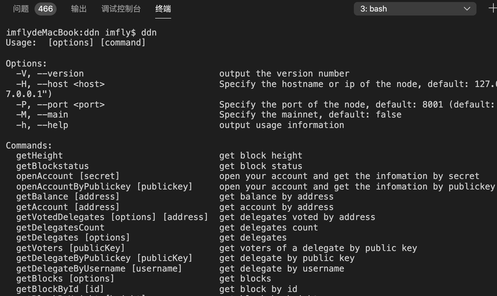

建议收藏 | 中国版的Cosmos，是如何做到分分钟造链的？
--------------------------
author: imfly
2020.1.24

---

今天，恰是全国抗击武汉肺炎的严峻时刻，中国武汉正式宣布关停所有离汉通道，全国各地群策群力、群防群控。作为一个区块链开发者，我只能选择呆在家里，持续更新区块链核心代码，撰写DDN区块链开发框架相关文档，做一个不添乱的支持者，衷心祝愿大家鼠年安康！

多年来，DDN区块链一直坚持“多链并行，跨链互通”的技术路线，坚持面向实体经济做国内最早的“企业级区块链系统”，所以被业界称为“中国版的Cosmos”。DDN区块链核心代码开源几个月来，得到众多小伙伴的关注和支持，应大家的要求，这篇文章就简单的介绍如何使用DDN快速造出自己的新区块链程序。

---

## 准备工作

默认你已经安装好了Node.js运行环境、git版本管理工具等，Node.js版本建议是`10.0.0`以上版本。另外，你最好在Linux环境或者Mac环境下，Win下使用虚拟机也可以，我没有在Win下的开发习惯，没有测试过，所以不保证下面的过程在Win下能如期运行。

---

特别说明的是，当前的DDN区块链，仍在快速迭代中，一些独立出来的模块还没有正式发布出去。另外，为了适配更多的数据存储方式、覆盖更多的资产类型，当前版本也没有刻意保持与主网2.0.2版本（仅能使用Sqlite数据库）的兼容性。待本版本升级发布之时，我会做兼容审查和适配。

---

## 下载源码

运行下面的命令，下载源码到本地：

```
$ git clone https://github.com/ddnlink/ddn.git
```

进入源码目录

```
$ cd ddn
```

---

## 本地构建

首先安装DDN源码使用到的工具包：

```
$ yarn
```

然后，初始化DDN区块链每个组件：

```
$ lerna bootstrap
```

构建代码

```
$ yarn build
```

---

## 初始化命令行工具

进入DDN命令行工具`ddn-cli`所在的目录

```
$ cd packages/ddn-cli
```

`link`一下吧，

```
$ yarn link
```

现在，输入下面的命令，查看是否安装成功

```
$ ddn
```

如果出现下面的内容，安装成功



在开发状态下，上述命令可以使用下面一条命令代替：

```
$ yarn run init // 这里必须要使用 run 命令
```

未来，我们将该工具发布之后，命令行工具安装方法为：

```
$ yarn global add @ddn/ddn-cli
```

---

## 生产新链

DDN区块链开发框架的使用非常简单，如果要生成属于自己的新链，只要下面一条命令即可

```
$ ddn generate blockchain MyName // 也可以使用别名 ddn g blockchain MyName
```

这个过程，软件会问你几个问题，只要根据提示一一作答即可。

---

## 小结

本版本发布之后，上述过程本质上就是下面两条命令

```
$ yarn global add @ddn/ddn-cli
$ ddn g blockchain MyName
```

