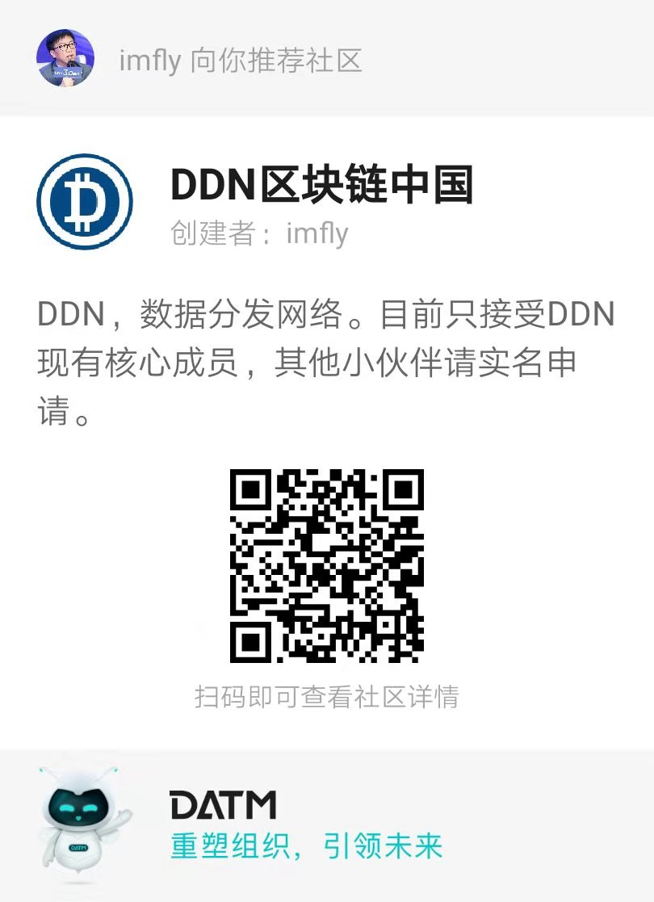

# blockchain-on-nodejs
《Node.js区块链开发2》

## 说明

时隔3年，《Node.js区块链开发》影响了一批人，代码也升级到了3.0，站在新的起点，计划推出《Node.js区块链开发》第二版，新的技术、新的视角和新的模式，但是不知道大家到底是否需要，如果您喜欢，请在第一条PR的下方回复，`期待+1`，如果有100个，我放下一起工作，启动新的分享。

2019年9月7日 imfly于北京

## 日志（Log）

- [x] 2020-1-28 [DDN区块链加密库的选择](./区块链解读/DDN区块链加密库的选择.md) 
- [x] 2020-1-24 [运行起来](./DDN区块链基础/1-运行起来.md) 
- [x] 2019-11-19 [前言视频](https://www.bilibili.com/video/av76296940)
- [x] 2019-11-11 [前言](./写在前面/0-前言.md) 

## 案例

- [DDN 主网](http://mainnet.ddn.link)
- [DDN 钱包](http://wallet.ddn.link)
- [DDN手机钱包](https://www.ddn.link/product/wallet)

## 社区

| Github Issue | DATM |
| ------------------------------------------------------- | ------------------------------------------------------------------------------------------- |
| [ddnlink/ddn/issues](https://github.com/ddnlink/ddn/issues) |  | 

> PS：DATM 是基于DDN区块链的 分布式任务管理工具，大家可以在上面领取任务、讨论问题，任务完成，系统通过`智能合约`支付给你DDN

## 捐赠

你可以通过[DDN钱包](http://wallet.ddn.link)或者[DDN手机钱包](https://www.ddn.link/product/wallet)向下面的地址捐赠`DDN`，这些DDN将被用于奖励本项目的贡献者.

| DDN基金会钱包转账地址 | DDN手机钱包扫码转账 |
| ------------------------------------------------------- | ------------------------------------------------------------------------------------------- |
| DLjrrVwnmMXstcAYVjcrpwyYb3kY1ehABU |  | 

## 贡献者（Contributors）

@imfly

## 协议

原创作品许可 [署名-非商业性使用-禁止演绎 3.0 未本地化版本 (CC BY-NC-ND 3.0)](http://creativecommons.org/licenses/by-nc-nd/3.0/deed.zh)
